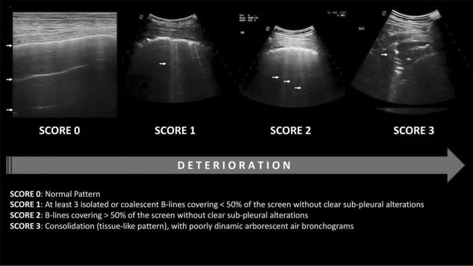

<!-- Improved compatibility of back to top link: See: https://github.com/othneildrew/Best-README-Template/pull/73 -->
<a name="readme-top"></a>
[![MIT License][license-shield]][license-url]
[![LinkedIn][linkedin-shield]][linkedin-url]


<!-- PROJECT LOGO -->
<br />
<div align="center">
  
  <h3 align="center">Covid-19 Ultrasound image score prediction using Convolutional Neural Networks</h3>

  <p align="center">
    Automatic assessment of lung ultrasound data from covid-19 patients, using ResNet-18, ResNet-50, EfficientNet-b0 and EfficientNet-b4!
    <br />
    <br />
    <a href="https://github.com/ZizZu94/masters-thesis/blob/main/zihadul_azam_thesis_2022.pdf">Thesis</a>
    ·
    <a href="#">Published article (coming soon)</a>
    ·
    <a href="https://www.disi.unitn.it/iclus">Dataset</a>
  </p>
</div>


<!-- ABOUT THE PROJECT -->
## About The Project

The aim of this project is to understand the behavior of state-of-the-art convolutional neural networks (CNNs) using lung ultrasound data from Covid-19 patients. The data was collected from covid-19 positive and covid-19 suspected patients. The dataset is made by video frames of ultrasound exams and each of them is labeled with 4 scores/classes. CNN models are trained to predict these four classes. This project is part of my Master's Degree thesis, you can read it [here](https://github.com/ZizZu94/masters-thesis/blob/main/zihadul_azam_thesis_2022.pdf).

<p align="right">(<a href="#readme-top">back to top</a>)</p>

### Dataset

For this research study, the Italian COVID-19 Lung Ultrasound DataBase (ICLUS-DB) is used. It was introduced by Italian researchers in a scientific research [paper](https://pubmed.ncbi.nlm.nih.gov/32406829/) in 2020. It contains a total of 277 lung ultrasound (LUS) videos from 35 patients, corresponding to 58,924 frames. Among them, 45,560 frames were acquired with the convex probe and 13,364 frames with the linear probe. All frames were labelled with four-level scoring system (score-0, score-1, score-2 and score-3). This scoring system classifies LUS frames by the severity of the pathology.

<div align="center">
  
</div>

For more information about the dataset please contact Dr. Libertario Demi - libertario.demi@unitn.it

### Networks

| Network name     | Number of parameters |
| :---             |                 ---: |
| `ResNet 18`      | 11'705'924           |
| `ResNet 50`      | 25'610'308           |
| `EfficientNet B0`| 5'323'392            |
| `EfficientNet B4`| 19'388'748           |

<p align="right">(<a href="#readme-top">back to top</a>)</p>

<!-- GETTING STARTED -->
## Getting Started

### Prerequisites

Install python3 and pip3: 
  ```sh
  sudo apt-get install -y python3 python3-pip
  ```
Install required dependencies: 
  ```sh
  pip3 install --no-cache-dir -r requirements.txt
  ```

### Run app

Run the application:
```sh
python3 main.py --model resnet-18 --epochs 120 --batch_size 32 --img_size 224
```

### Create Docker image:

```sh
docker build DockerFile
```

### Create Singularity image:

```sh
sudo singularity build image-name.sif Singularity.def
```
<!-- CONTACT -->
## Contact

Zihadul Azam - [Linkdin](https://www.linkedin.com/in/zihadul-azam/) - azamzihadul@hotmail.it

Published article link [coming soon...]()

<p align="right">(<a href="#readme-top">back to top</a>)</p>

<!-- ACKNOWLEDGMENTS -->
## Acknowledgments

Use this space to list resources you find helpful and would like to give credit to. I've included a few of my favorites to kick things off!

* [ResNet transfer learning pytorch](https://pytorch.org/tutorials/beginner/transfer_learning_tutorial.html)
* [EfficientNet](https://debuggercafe.com/transfer-learning-using-efficientnet-pytorch/)
* [Singularity](https://docs.sylabs.io/guides/3.5/user-guide/introduction.html)
* [Docker](https://docs.docker.com/get-started/)
* [Ref dataset image](https://theultrasoundjournal.springeropen.com/articles/10.1186/s13089-022-00264-8)

<p align="right">(<a href="#readme-top">back to top</a>)</p>


<!-- MARKDOWN LINKS & IMAGES -->
<!-- https://www.markdownguide.org/basic-syntax/#reference-style-links -->
[license-shield]: https://img.shields.io/github/license/othneildrew/Best-README-Template.svg?style=for-the-badge
[license-url]: https://github.com/othneildrew/Best-README-Template/blob/master/LICENSE.txt
[linkedin-shield]: https://img.shields.io/badge/-LinkedIn-black.svg?style=for-the-badge&logo=linkedin&colorB=555
[linkedin-url]: https://www.linkedin.com/in/zihadul-azam/